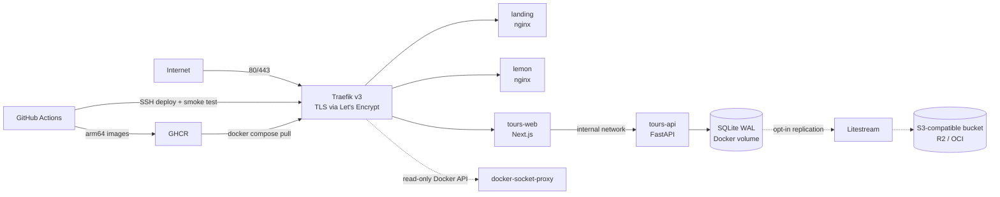

# luciel-platform

[](https://github.com/Jaed69/luciel-platform/actions/workflows/release.yml)

A self-hosted "productized portfolio": a monorepo behind `luciel.dev` where each subdomain is a real, containerized web app, deployed to a single ARM VPS by a fully automated pipeline (change detection, native arm64 builds, vulnerability gate, encrypted secrets, health-checked rollout with automatic rollback).

The point is not the screenshots, it is the engineering: every push to `main` that touches an app builds, tests, scans, and ships it to production without manual steps.

## Live

| App | URL | What it is | Stack |
|-----|-----|------------|-------|
| `landing` | [luciel.dev](https://luciel.dev) | Root domain. Currently an "under construction" page; the content hub is on the roadmap. | Astro, Tailwind, nginx |
| `lemon` | [lemon.luciel.dev](https://lemon.luciel.dev) | A personal digital memory book (photos, video, music, public guestbook). | Astro, Tailwind, Supabase (guestbook) |
| `tours` | [tours.luciel.dev](https://tours.luciel.dev) | Double-entry accounting panel for a tour agency/hotel in Cusco: sales, commissions, settlements, audit log. **Login-only back-office for a real client; there are no public routes beyond the sign-in page.** | Next.js, FastAPI, SQLite (WAL) |

`tours.luciel.dev` has no public demo. The code is here; see [`apps/tours/STATUS.md`](apps/tours/STATUS.md) for what it does and how it was built.

## Architecture



- Routing is label-driven: a new app is a new container with Traefik labels, no proxy config edits ([`docker-compose.yml`](docker-compose.yml)).
- Traefik reaches Docker through a read-only [docker-socket-proxy](docker-compose.yml) instead of mounting the raw socket.
- `tours-api` has no router and sits on an `internal: true` network; only `tours-web` can reach it.
- Global security-headers and rate-limit middlewares apply to every router ([`traefik/traefik.yml`](traefik/traefik.yml), [`traefik/dynamic/middlewares.yml`](traefik/dynamic/middlewares.yml)).
- Application containers run with `no-new-privileges`, `cap_drop: ALL`, read-only root filesystems, tmpfs for writable paths, and memory limits.

## Engineering highlights

- **CI/CD pipeline** ([`.github/workflows/release.yml`](.github/workflows/release.yml)). A `changes` job diffs each app against the revision label of its current `latest` image ([`scripts/needs-build.sh`](scripts/needs-build.sh)), so only changed apps rebuild; the rest are retagged registry-side. Builds run on native arm64 runners (no QEMU), run each app's tests/lint first, push a `sha-<7>` tag, gate on a Trivy scan (fixable CRITICAL fails the run), and only then promote `latest`. Third-party actions are pinned to full commit SHAs.
- **Deploy with rollback** ([`docs/operations.md`](docs/operations.md)). One SSH step pins the whole stack to the built commit, runs `docker compose up -d --wait`, then a smoke test ([`scripts/verify-prod.sh`](scripts/verify-prod.sh)) checks the production Let's Encrypt cert and HTTPS on every host. On failure it restores the previous `.env` and git checkout and brings the old stack back.
- **Secrets with SOPS + age** ([`.sops.yaml`](.sops.yaml), [`env/production.env`](env/production.env)). Production config is committed encrypted. The runner decrypts it, masks every value, and validates it ([`scripts/check-env.sh`](scripts/check-env.sh)) before deploy. Only SSH access and the age key live in GitHub secrets.
- **Backups** ([`apps/tours/litestream/litestream.yml`](apps/tours/litestream/litestream.yml)). Optional Litestream sidecar replicates the SQLite DB to an S3-compatible bucket; the restore procedure with an integrity check is documented in [`docs/operations.md`](docs/operations.md). It is enabled only when its credentials are set.
- **Dependabot policy** ([`.github/dependabot.yml`](.github/dependabot.yml)). Weekly, grouped minor/patch updates across GitHub Actions, pnpm, uv, Docker base images and compose images; majors are taken deliberately.
- **Tests.** `tours-api`: 21 pytest modules in [`apps/tours/api/tests/`](apps/tours/api/tests) covering double-entry balance, RBAC, audit log, commissions, settlements. `tours-web`: 15 vitest files in [`apps/tours/web/tests/`](apps/tours/web/tests). The pipeline helpers have their own shell tests ([`scripts/test-check-env.sh`](scripts/test-check-env.sh), [`scripts/test-needs-build.sh`](scripts/test-needs-build.sh)).
- **Lint gate.** `tours-web` must pass ESLint ([`eslint.config.mjs`](apps/tours/web/eslint.config.mjs)) before its image is built.
- **Domain correctness in `tours`.** Double-entry balance validated in Python with integer cents, structural audit log via SQLAlchemy `before_flush` with password hashes redacted, a four-level commission precedence resolver, Alembic migrations ([`apps/tours/api/migrations/`](apps/tours/api/migrations)).

`landing` and `lemon` have no lint or test gate yet; the pipeline comment says so explicitly.

## Tech stack

| Layer | Technology |
|-------|------------|
| Edge | Traefik v3, Let's Encrypt (HTTP-01), docker-socket-proxy |
| Orchestration | Docker Compose on a single arm64 VPS |
| Content sites | Astro, Tailwind CSS v4, nginx |
| Tours frontend | Next.js (App Router), React, NextAuth (credentials), Tailwind CSS v4 |
| Tours backend | FastAPI, SQLAlchemy async, aiosqlite, Pydantic v2, Alembic, bcrypt, PyJWT |
| Database | SQLite (WAL) on a named Docker volume, Litestream backups (opt-in) |
| CI/CD | GitHub Actions, GHCR, Trivy, SOPS + age, Dependabot |
| Tooling | pnpm workspaces, uv, vitest, pytest, ESLint |

## Repository layout

```
.
├── apps/
│   ├── landing/        Astro site for luciel.dev
│   ├── lemon/          Astro memory-book site
│   └── tours/
│       ├── api/        FastAPI + SQLite + Alembic + pytest
│       ├── web/        Next.js + vitest
│       └── litestream/ backup replication config
├── docs/               Operations runbook (deploy, rollback, backups, secrets)
├── env/                development.env (dummy values) and production.env (SOPS-encrypted)
├── scripts/            Deploy smoke tests, env validation, build/skip decision (+ tests)
├── traefik/            Static and dynamic proxy config
├── .github/            Release workflow and Dependabot config
├── docker-compose.yml  Whole stack
└── DESIGN.md           Design reference notes used for the sites' look and feel
```

## Local development

Requirements: Node 26 and pnpm (see `packageManager` in [`package.json`](package.json)), Python 3.14+ and [uv](https://docs.astral.sh/uv/) for `tours-api` ([`pyproject.toml`](apps/tours/api/pyproject.toml)).

```bash
pnpm install                                   # whole JS workspace

# Astro sites
pnpm --filter @luciel/landing dev
pnpm --filter @luciel/lemon dev

# tours-web (http://localhost:3000)
pnpm --filter @luciel-platform/tours dev
pnpm --filter @luciel-platform/tours lint
pnpm --filter @luciel-platform/tours test

# tours-api (http://localhost:8000/health)
(cd apps/tours/api && uv sync && uv run --extra dev pytest)
(cd apps/tours/api && uv run uvicorn app.main:app --reload --port 8000)

# pipeline helper tests
bash scripts/test-check-env.sh
bash scripts/test-needs-build.sh
```

To run `tours-web` against a local API outside Docker, set `TOURS_API_URL=http://localhost:8000` ([`apps/tours/README.md`](apps/tours/README.md)). The full stack can be started with `docker compose --env-file env/development.env up -d` ([`docs/operations.md`](docs/operations.md)); that file holds dummy values only.

## Roadmap

From [`.planning/ROADMAP.md`](.planning/ROADMAP.md):

- Done: infrastructure and landing scaffold; the `tours` accounting panel.
- Content hub on `luciel.dev`: personal intro, technical blog (MDX), projects page, RSS, Open Graph tags.
- Legal pages (privacy, terms, contact), sitemap and robots for search indexing.
- First standalone web tool on its own subdomain, plus a documented "add a new app" recipe.

## Author

Jhamil Peña. GitHub: [@Jaed69](https://github.com/Jaed69). Site: [luciel.dev](https://luciel.dev).
