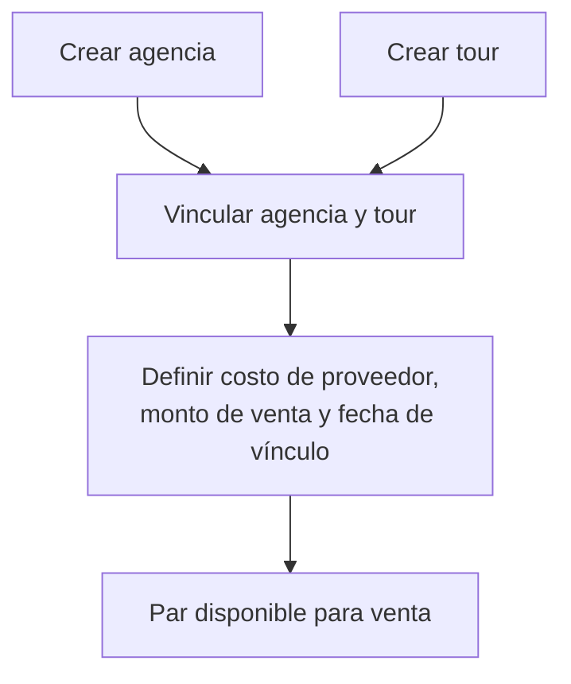
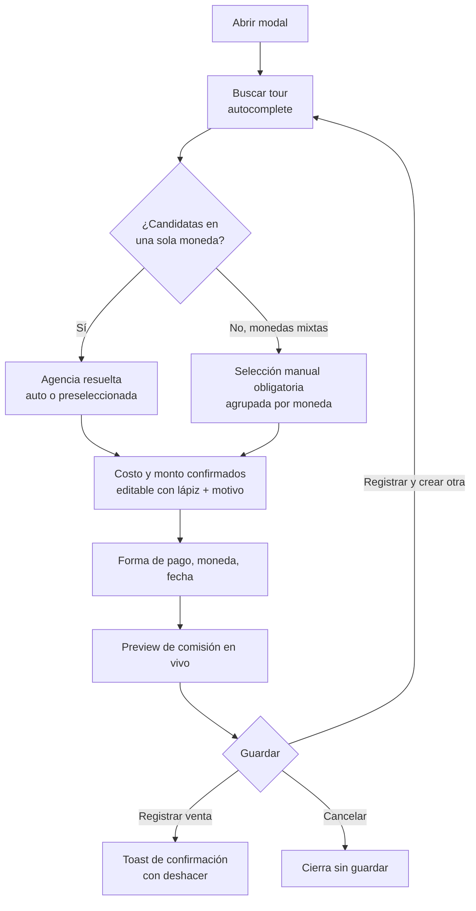

# Especificación de flujo — catálogo y registro de venta
### Tours Panel Contable · brief de diseño/UX para implementación

> Este documento formaliza las decisiones tomadas durante la sesión de diseño de flujo.
> No cubre stack técnico ni arquitectura de código — es la capa de lógica de negocio,
> estados de UI y experiencia que debe implementarse. Usar junto con
> `README.md` / `STATUS.md` del repo para el contexto técnico real (rutas, modelos, RBAC).

---

## 1. Alcance de este documento

Cubre dos flujos interdependientes:

1. **Catálogo** (contabilidad/admin) — cómo se crean y vinculan agencias y tours.
2. **Registro de venta** (vendedor) — cómo se consume ese catálogo para registrar una venta,
   con las mejoras de UX aplicadas para optimizar velocidad de captura.

El segundo flujo depende por completo del primero: una venta no puede registrarse sobre
un par agencia-tour que no tenga precio vinculado.

---

## 2. Modelo de estados — catálogo

### 2.1 Entidades y su ciclo de vida

| Entidad | Puede crearse sola | Estado inicial | Estado final (requerido para venta) |
|---|---|---|---|
| Agencia | Sí | `sin_tours_vinculados` | `operativa` (≥1 tour vinculado con precio) |
| Tour | Sí | `sin_agencia_vinculada` | `disponible_para_venta` (≥1 agencia vinculada con precio) |
| Vínculo agencia-tour | No (requiere ambas entidades) | — | Contiene: `costo_proveedor`, `monto_venta`, `fecha_vinculo` |

**Regla de negocio**: ni agencia ni tour bloquean su creación por falta del otro (a diferencia
de una validación previa que se descartó). Lo que sí se bloquea es la **venta**: un tour sin
ningún vínculo activo no debe aparecer como opción seleccionable en el formulario de venta.

### 2.2 Regla de desempate de precio

Cuando un tour tiene 2+ agencias vinculadas **cotizando en la misma moneda** con el mismo
precio más bajo, se preselecciona la agencia cuyo **vínculo (`fecha_vinculo`) sea más
reciente**. Esta regla solo aplica dentro de un mismo grupo de moneda — candidatas
cotizando en monedas distintas nunca se comparan por precio crudo entre sí (ver §3.1
paso 3 y `catalogo/07-vinculo-agencia-tour.md` §1 para el detalle completo, incluyendo el
caso de monedas mixtas que fuerza selección manual).

### 2.3 Flujo de creación (dos entradas independientes, un punto de convergencia)

Ambas entradas (A y B) pueden ocurrir en cualquier orden, incluso separadas en el tiempo
(ej. contabilidad precarga 50 tours un día, y va vinculando agencias las semanas siguientes).

### 2.4 Campos por entidad (propuesta — confirmar con negocio antes de implementar)

**Agencia**
- Nombre (obligatorio)
- Moneda operativa (PEN / USD)
- Estado (`sin_tours_vinculados` / `operativa`) — calculado, no editable manualmente

**Tour**
- Nombre (obligatorio)
- Tipo de tour (`tipos_tour`, ya existe en catálogo actual)
- Estado (`sin_agencia_vinculada` / `disponible_para_venta`) — calculado

**Vínculo agencia-tour (`AgenciaTourPrecio`)**
- Costo de proveedor (obligatorio)
- Monto de venta (obligatorio)
- Fecha de vínculo (automática, usada para desempate)

> Pendiente de confirmar: campos adicionales de contacto/RUC en agencia, duración/descripción en tour.

---

## 3. Flujo de registro de venta (vendedor) — versión final

### 3.1 Narrativa

**Actor**: vendedor
**Precondición**: sesión iniciada; existe al menos un par agencia-tour con precio configurado.
**Disparador**: clic en "Registrar venta" desde `/ventas`.
**Postcondición**: venta creada, comisión calculada, modal cerrado, lista refrescada.

1. Se abre el modal. El vendedor se muestra como **contexto visual** (texto, no campo de formulario).
2. Selecciona **tour** mediante un buscador combinado (ver 4.1).
3. El sistema resuelve la **agencia** automáticamente:
   - Si solo hay 1 agencia vinculada a ese tour → se autoselecciona, sin interacción.
   - Si hay 2+ **cotizando en la misma moneda** → se preselecciona la de menor precio
     (desempate: vínculo más reciente), visible y cambiable en un dropdown normal.
   - Si hay 2+ **con monedas mixtas entre candidatas** (ej. una en PEN, otra en USD) →
     no se auto-selecciona ni preselecciona ninguna; el campo se muestra como selección
     manual obligatoria, agrupado visualmente por moneda para dar contexto de
     comparación. *(Actualizado — ver `catalogo/07-vinculo-agencia-tour.md` §1 para el
     detalle completo de esta regla.)*
4. **Costo de proveedor** y **monto a cobrar** aparecen confirmados (solo lectura), cada uno
   con un ícono de lápiz individual para edición puntual de excepción.
5. Completa **forma de pago**, **moneda**, **fecha** (default: hoy).
6. Expande **notas internas** si lo necesita (opcional, colapsado por defecto).
7. Ve el **preview de comisión** actualizado en vivo desde el paso 2.
8. Clic en **Registrar venta** (o **Registrar y crear otra** — ver 4.4) / **Cancelar**.

### 3.2 Diagrama del flujo

### 3.3 Tabla de campos final

| Campo | Tipo de interacción | Origen del valor |
|---|---|---|
| Vendedor | Contexto visual, no editable | Sesión |
| Tour | Autocomplete de búsqueda | Catálogo, priorizando tours recientes del vendedor |
| Agencia | Auto (1 opción), preselección editable (2+ misma moneda), o selección manual obligatoria agrupada por moneda (2+ monedas mixtas) | Vínculo agencia-tour |
| Costo de proveedor | Confirmado, editable con lápiz + motivo | Vínculo agencia-tour |
| Monto a cobrar | Confirmado, editable con lápiz + motivo | Vínculo agencia-tour |
| Forma de pago | Selección, con último valor usado como default | Catálogo + historial del vendedor |
| Moneda | Selección, con último valor usado como default | Catálogo + historial del vendedor |
| Fecha | Input con default "hoy" | — |
| Notas internas | Textarea opcional, colapsado | — |

---

## 4. Mejoras de UX aplicadas

### 4.1 Velocidad de captura

- **Buscador combinado tour + agencia**: un solo input tipo autocomplete. Al escribir el
  nombre del tour, el resultado ya trae la agencia resuelta (auto o preseleccionada) en el
  caso común. Colapsa 2 decisiones en 1 interacción. **Excepción**: si el tour tiene
  candidatas en monedas mixtas, el resultado no trae agencia resuelta — se marca como
  `requires_manual_selection` y el vendedor debe elegir explícitamente desde un selector
  agrupado por moneda antes de continuar (ver §2.2 y §3.1 paso 3).
- **"Tours recientes" primero**: los 3–5 tours más vendidos por ese vendedor aparecen antes
  que el resto del catálogo en el autocomplete.
- **Recordar última forma de pago / moneda** usada por el vendedor, como default del campo.
- **Navegación completa por teclado**: orden de tab lógico
  (tour → forma de pago → moneda → fecha → notas → Enter para registrar).

### 4.2 Prevención de errores

- **Motivo obligatorio en edición de excepción**: al usar el lápiz sobre costo/monto, un
  dropdown corto de motivo (ej. "convenio desactualizado", "descuento especial"). Da
  trazabilidad automática a contabilidad sin fricción real para el vendedor.
- **Aviso de posible duplicado**: si tour + agencia + monto + fecha coinciden con una venta
  reciente, mostrar advertencia suave antes de guardar (previene doble clic accidental).
- **Validación en línea**, no solo al intentar enviar.

### 4.3 Continuidad de trabajo

- **"Registrar y crear otra"**: segunda acción junto al botón principal. Vuelve directo al
  buscador de tour sin cerrar el flujo — pensado para vendedores registrando un lote de
  ventas del día.
- **Confirmación tipo toast con deshacer**, en vez de un modal de éxito que interrumpe el flujo.

### 4.4 Mobile

- El buscador combinado tour + agencia es prioritario en mobile (evita dropdowns largos en
  pantalla chica). El resto de campos mantiene el mismo orden y lógica que en escritorio.

---

## 5. Sistema de diseño — semántica de estados (aplica a todo el sistema, no solo ventas)

### 5.1 Color por significado

| Color | Significado | Ejemplos en este flujo |
|---|---|---|
| Gris | Estructural / neutral | Contexto (vendedor), navegación, botones de acción neutra |
| Teal | Contenido vivo / interactivo | Buscador de tour, preview de comisión, agrupación de pago |
| Verde | Confirmado por el sistema / éxito | Costo y monto auto-resueltos, disponibilidad de venta, confirmación final |
| Ámbar | Punto de decisión del sistema (reservado, ya no aplica en venta tras quitar la rama de precio inexistente) | — |
| Coral | Requiere atención / acción manual pendiente | Reservado para validaciones con error real |

### 5.2 Patrón "auto por defecto, editable si hace falta"

Patrón recurrente que debe mantenerse consistente en todo el sistema, no solo en ventas:

- El sistema resuelve el valor más probable automáticamente.
- El valor se muestra confirmado (verde/visual), no como campo activo.
- Un ícono de lápiz explícito habilita edición puntual, siempre pidiendo motivo si es un
  valor financiero (costo, monto, precio).

Aplica a: agencia (auto/preseleccionada), costo de proveedor, monto a cobrar, forma de
pago/moneda (default por historial). **Excepción al patrón**: cuando las candidatas de
agencia cotizan en monedas mixtas, el sistema deliberadamente NO resuelve un valor por
defecto — exige selección manual explícita agrupada por moneda, para no comparar precios
crudos entre monedas distintas (ver §2.2).

### 5.3 Jerarquía tipográfica de campos

- Label: peso 500, tamaño pequeño, color secundario.
- Valor: peso 400, tamaño normal, color primario.
- Texto de ayuda (ej. "prellenado, sugerido por lista de precios"): tamaño menor, color muted —
  nunca el mismo tono que el valor.

---

## 6. Pendiente de definir antes de implementar

- Campos completos de "agencia" (contacto, RUC, etc.) y "tour" (duración, descripción).
- Umbral exacto de "tours recientes" (¿últimos 30 días? ¿top 5 por volumen?).
- Copy exacto del motivo de excepción (lista cerrada vs texto libre).
- Comportamiento del toast con deshacer: ventana de tiempo para deshacer, qué revierte exactamente.
- Si el buscador combinado tour+agencia debe mostrar el precio en el resultado del autocomplete
  antes de seleccionar, o solo después.

---

## 7. Siguiente flujo a formalizar

Este documento cierra **catálogo** y **registro de venta**. El siguiente tramo pendiente,
usando el mismo método (narrativa → tabla de campos → diagrama → estados de color), es
**liquidaciones** (contabilidad): abrir batch, auto-asignación de ventas sin liquidar, cierre
con generación de asientos, y flujo de reapertura/reversión.
